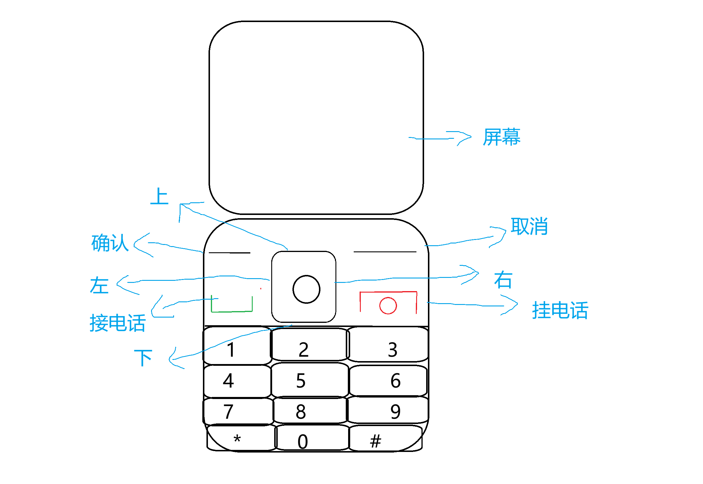

# 老年机联系人

模拟老年机界面的联系人管理应用。所有页面：上方屏幕 + 下方按键。



## 项目结构

```
src/
├── Main.java                          # 程序入口
├── model/
│   └── Contact.java                   # 联系人 JavaBean
├── components/
│   ├── ButtonAction.java              # 接口：按钮行为 onPress()
│   ├── PhoneButton.java               # 抽象类 extends JButton（按钮基类）
│   ├── NumberButton.java              # 继承 PhoneButton：数字按键
│   ├── FunctionButton.java            # 继承 PhoneButton + 实现 ButtonAction：拨号/挂断
│   └── NavButton.java                 # 继承 PhoneButton + 实现 ButtonAction：导航键
├── pages/
│   ├── ScreenOffPage.java             # 黑屏页
│   ├── LockScreenPage.java            # 解锁页（# + 确认解锁）
│   ├── MenuPage.java                  # 菜单页（联系人/拨号/短信/设置）
│   ├── HomePage.java                  # 联系人列表页
│   ├── ContactDetailPage.java         # 联系人详情页（编辑/拨号/删除）
│   └── AddEditContactPage.java        # 新增/编辑联系人页（T9输入）
├── ui/
│   ├── PhoneFrame.java                # 主窗口（屏幕+按键）
│   ├── ScreenPanel.java               # 屏幕状态机（CardLayout）
│   └── KeypadPanel.java               # 按键面板（3x3 控制 + 数字键盘）
├── db/
│   └── DatabaseManager.java           # MySQL 连接管理 + 自动建表
└── repository/
    ├── ContactRepository.java          # 接口：CRUD 契约
    └── ContactRepositoryImpl.java      # 实现 ContactRepository：MySQL 增删改查
```

## 页面流程（6个页面）

| 页面 | 说明 |
|------|------|
| 黑屏 | 按任意键亮屏 |
| 解锁 | 按 # 再按确认解锁，按错有提示 |
| 菜单 | 左右键循环切换功能，确认进入 |
| 联系人列表 | 上下循环翻页，确认查看详情，拨打新增 |
| 联系人详情 | 确认=编辑，拨打=拨号，挂断=删除，取消=返回 |
| 新增/编辑 | 数字键盘T9输入，#切换字母/数字模式，确认保存 |

## 类继承与接口（评分要点）

```
JButton
  └── PhoneButton (abstract)    ← 抽象类，统一样式
        ├── NumberButton        ← 数字键
        ├── FunctionButton      ← 功能键（实现 ButtonAction 接口）
        └── NavButton           ← 导航键（实现 ButtonAction 接口）

ButtonAction (interface)        ← 定义 onPress() 行为
  - 由 FunctionButton, NavButton 实现

ContactRepository (interface)   ← 定义增删改查契约
  - 由 ContactRepositoryImpl 实现
```

## 数据库（评分要点）

- **连接**：`db/DatabaseManager.java` — JDBC 连接 MySQL
- **增**：`ContactRepositoryImpl.insert()` — 新增联系人
- **查**：`ContactRepositoryImpl.findAll()` — 查询所有联系人
- **改**：`ContactRepositoryImpl.update()` — 编辑联系人
- **删**：`ContactRepositoryImpl.delete()` — 删除联系人
- 启动时自动建表并插入示例数据

## 如何运行

1. IDEA 中打开项目
2. 将 `lib/mysql-connector-j-8.3.0.jar` 添加到项目 Libraries（File → Project Structure → Libraries → +）
3. 修改 `db/DatabaseManager.java` 中的数据库连接参数
4. 运行 `Main.java`

---

## 附：Java课程项目要求

题目自拟，评分标准如下：

1. 有GUI（1个页面10分，合计不超过40分）
2. 有类与类之间的继承、实现（10分）
3. 使用 JetBrains IDEA 创建项目，可运行（10分）
4. 使用数据库，增删改查中的一项即可（10分）
5. 项目运行起来后项目内容的视频录音录屏介绍（1分钟内，25分）
6. 所有项目文件、视频文件等放在一个文件夹中，文件夹命名学号-姓名（xxxxxxxxxx-张三），打包压缩为zip格式提交（5分）

视频介绍要包含项目功能介绍，GUI中的1页面，2页面，3页面等。哪几个文件中有继承，继承的哪个类。数据库连接在哪里，执行了哪些数据库操作。
